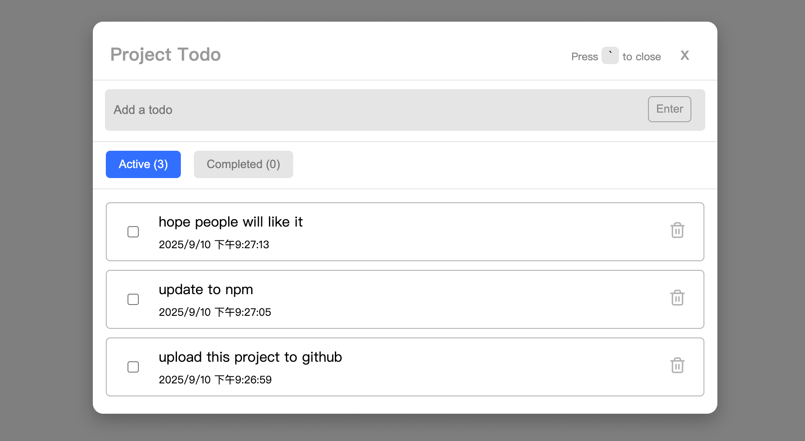

# Npm Simple Todo Addon



A simple todo list for your local development process! It create a floating todo list toggle on your site, and you can toggle your todo list with ease.

You can also press <code>`</code> to toggle the todo list.

Todos are saved in **localStorage**, so they persist between sessions.

---

## 1. Install

```bash
npm install @klu0926/todo
```

## 2. Usage

```js
import init from 'my-simple-todo'

init({
  storageName: 'myApp', // required
  color: 'black',
  position: 'right',
  hasShortcuts: true,
})
```

- storageName (required) : unique name for localStorage key
- color (optional) : tobo button color, default black
- position (optional) : display on left / right, default to right
- hashShortcuts (optional) : allow toggle with ` key, default to true
